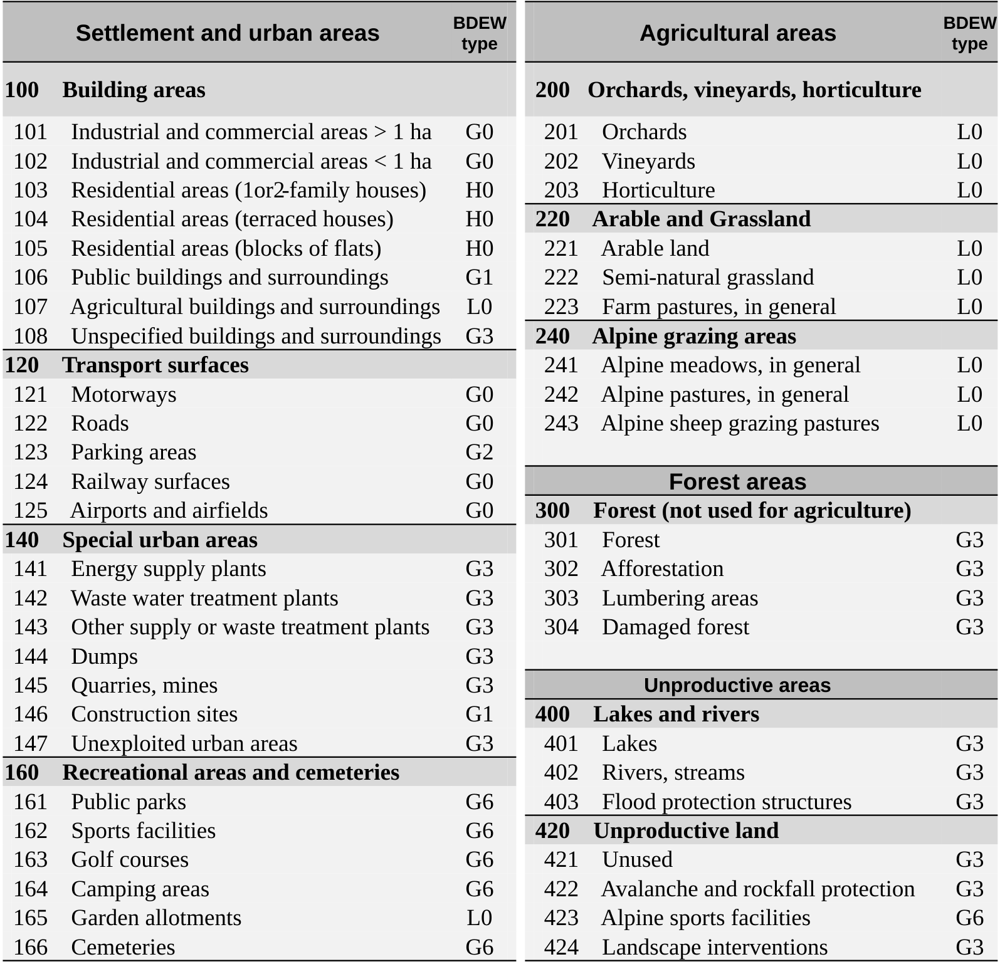

This text is adapted from the original article *[Carbon flow tracing in distribution grids: from method to application](https://www.sciencedirect.com/science/article/pii/S0378779626008412)* published in Electrical Power and Energy Research, DOI: [10.1016/j.epsr.2026.113548](https://doi.org/10.1016/j.epsr.2026.113548). © by the authors. This content is licensed under a Creative Commons Attribution 4.0 International License (CC-BY-4.0). Layout and styling have been modified for this website.

If you find this work useful, please cite the original article as follows:

::: {.panel-tabset}
## BibTeX

```bibtex
@article{liu2027,
  author = {Liu, Wenyu and Figini, Enea and Paolone, Mario},
  title = {Carbon Flow Tracing in Distribution Grids: From Method to
    Application},
  journal = {Electric Power Systems Research},
  volume = {262},
  pages = {113548},
  date = {2027-01-01},
  url = {https://www.sciencedirect.com/science/article/pii/S0378779626008412},
  doi = {10.1016/j.epsr.2026.113548},
  issn = {0378-7796},
  langid = {en}
}
```

## IEEE

W. Liu, E. Figini, and M. Paolone, “Carbon flow tracing in distribution grids: from method to application,” Electric Power Systems Research, vol. 262, p. 113548, Jan. 2027, doi: 10.1016/j.epsr.2026.113548. Available: https://www.sciencedirect.com/science/article/pii/S0378779626008412

## APA

Liu, W., Figini, E., & Paolone, M. (2027). Carbon flow tracing in distribution grids: From method to application. Electric Power Systems Research, 262, 113548.

## Harvard

Liu, W., Figini, E. and Paolone, M., 2027. Carbon flow tracing in distribution grids: From method to application. Electric Power Systems Research, 262, p.113548.

:::

## Introduction

### Background

The accelerating impacts of climate change have placed carbon emissions at the center of global environmental and energy policy agendas [@zhouWorldwideCarbonNeutrality2023]. To mitigate these impacts, countries worldwide have committed to achieving net-zero greenhouse gas emissions within the coming decades [@vansoestNetzeroEmissionTargets2021]. Reaching this goal requires not only the large-scale deployment of renewable energy and electrification technologies but also accurate and transparent carbon accounting across all levels of the energy system [@liReviewCarbonEmission2024]. By quantifying where and how emissions occur, carbon accounting provides the analytical foundation for evaluating decarbonization progress, designing effective carbon pricing mechanisms, and supporting climate-aligned investment and operational decisions [@steiningerMultipleCarbonAccounting2016].


Carbon emissions can be categorized into two groups: direct and indirect emissions. In the electricity sector, the former refers to emissions from electricity generation and transmission, while the latter corresponds to emissions associated with electricity consumption [@liReviewCarbonEmission2024]. For estimating direct emissions, the Intergovernmental Panel on Climate Change (IPCC) proposed some approaches including the use of emission factors, mass balances, and satellite-based observations [@eggleston2006IPCCGuidelines2006; @shuklaClimateChangeLand2019]. While this direct perspective provides a foundation for quantifying generation-side carbon responsibility, it overlooks the influence of consumers in driving the demand. The issue can be addressed by indirect carbon emission accounting. Traditional indirect accounting methods, however, often rely on national or zonal average emission factors, which fail to capture the spatial and temporal heterogeneity introduced by local renewable generation and network constraints [@jiGreenhouseGasEmission2016]. To overcome this limitation, [@kangCarbonEmissionFlow2012] introduced the concept of carbon emission flows, derived from tracking of electricity flows through the network. Fortunately, power flow allocation methods, such as average participation [@bialekTopologicalGenerationLoad1997], marginal participation [@rudnickMarginalPricingSupplement1995], and equivalent bilateral exchanges [@galianaTransmissionNetworkCost2003; @conejoZbusTransmissionNetwork2007], have long been developed for costs/losses allocation and/or line congestion attribution. These methods can naturally be extended to trace carbon flows, since emissions are physically coupled with power exchanges. For instance, [@tranbergRealtimeCarbonAccounting2019] proposed a real-time carbon accounting method for European electricity markets, while [@kangCarbonEmissionFlow2015] developed a virtual network flow-based framework to quantify the carbon footprint of electricity transmission and consumption. 

Nevertheless, most existing studies focus primarily on transmission networks, limiting the spatial granularity and practical relevance of the assessments at the local level. Yet, the ongoing decarbonization of power systems increasingly involves distribution networks, where distributed energy resources (DERs) such as photovoltaic (PV) systems and battery storage systems play an important role [@jacquierNationalEnergySystem2025]. As distribution grids evolve into prosumer-dominated systems, understanding how carbon emissions propagate through the grid’s multiple voltage levels becomes critical for both policy design and operational decision-making. However, extending carbon tracing to distribution grids remains challenging due to the complexity of network topology and the bidirectional nature of power flows. This motivates the development of new frameworks that can extend carbon flow tracing to the distribution level, providing higher spatial resolution and capturing the effects of local generation and consumption behaviors.


### Contributions of this Work
Our main contributions are the following:

- A linear programming (LP) formulation of the practical carbon flow tracing. The proposed algorithms are based on the average participation power flow allocation method, complemented by prosumer-oriented and losses allocation schemes.
- Study cases: the performance of the proposed algorithms is first demonstrated using a simplified toy example that illustrates the underlying principles of carbon allocation in mixed-generation systems. Then, the algorithms are integrated into a self-standing framework for the carbon allocation and applied to a synthetic distribution grid of a real city in Switzerland. 
- The developed framework is released as [an open-source Python package](https://github.com/DESL-EPFL/cflowdist) to facilitate reproducibility and transparency and enable further research studies. 

The rest of this paper is organized as follows: @sec-Methodology states the workflow and describes the carbon flow tracing methods, @sec-study-case-I presents a small example problem for comparing the proposed tracing methods, @sec-study-case-II applies the framework in a synthetic Swiss distribution grid. Finally, @sec-Conclusion concludes the paper.


## Methodology {#sec-Methodology}

### Framework Flow Chart
To trace carbon flows in distribution grids, we rely on the steps depicted in @fig-workflow.

{#fig-workflow width=45%}


### Step 1: Boundary Conditions
The framework requires nodal demand and generation data. Since carbon intensity depends on generator types, this information should also be available. Moreover, we assume that carbon intensities of the feeding transmission layer are available (e.g., via sources such as [@EmissiumDocs; @mapsSwitzerland2024Carbon2024]). As the definition of boundary conditions is highly dependent on the available data, we provide examples based on open-data in @sec-study-case-I and @sec-study-case-II.

### Step 2: Load Flow
We perform a non-approximated AC power flow analysis to compute the branch power flows, which are required for the proposed carbon allocation method. 

### Step 3: Carbon Flow Tracing {#sec-Carbon-Flow-Tracing}

#### Lossless carbon allocation {#sec-Lossless-carbon-allocation}
The carbon intensities of electricity sources are coupled with the lossless average-participation power allocation method described in [@bialekTopologicalGenerationLoad1997; @horschFlowTracingTool2018]. 


For a network with $n$ nodes collected in the set $\mathcal{N}$, and branches collected in $\mathcal{L}$, let $p_i^\text{in}$ and $p_i^\text{out}$ be the net power injection and ejection at node $i\in \mathcal{N}$, we have:
$$
\begin{cases}
p_i^\text{in} &= \max{ \{(g_i - l_i),0 \}} + m_i\\
p_i^\text{out} &= \max{ \{-(g_i - l_i),0 \}} + x_i
\end{cases}
$$

where strictly nonnegative $g_i$, $m_i$, $l_i$ and $x_i$ are, respectively, the generated power, imported power, load power and exported power at node $i$.  Let nonnegative $F_{i\rightarrow j}^\text{in}$ and  $F_{i\rightarrow j}^\text{out}$ denote the power inflow to node $j$ from $i$ and outflow from node $i$ in direction of $j$, where $(i,j)\in\mathcal{L}$, by imposing the nodal power balance, we get \eqref{eq-nodal-power-balance}:
$$
p_i^\text{in} + \sum_{(i,j)\in\mathcal{L}} F_{j\rightarrow i}^\text{in}  = p_i^\text{out} +  \sum_{(i,j)\in\mathcal{L}} F_{i\rightarrow j}^\text{out} \label{eq-nodal-power-balance}
$$ {#eq-nodal-power-balance}

By naming the known injected carbon intensities from the generators and external grid imports as $\rm{\bf{c_g}}$ and $\rm{\bf{c_m}}$, and by introducing the unknown nodal carbon intensities as $\rm{\bf{c_x}}$, similar to the nodal power balance in \eqref{eq-nodal-power-balance}, the nodal carbon flow balance for node $i$ is expressed in \eqref{eq-nodal-carbon-balance}.
$$
g_i {c_g}_i + m_i {c_m}_i + \sum_{j} F_{j\rightarrow i}^\text{in}{c_x}_j = (l_i +x_i){c_x}_i + \sum_{j} F_{i\rightarrow j}^\text{out}{c_x}_i
\label{eq-nodal-carbon-balance}
$$ {#eq-nodal-carbon-balance}

Instead of relying on closed-form solutions, we propose an optimization-based formulation of the allocation problem below. Assuming that the carbon intensities extracted from the network are always less than or equal to the highest carbon intensities injected into the network, the determination of $\rm{\bf{c_x}}$ (LL method) can be formulated as the LP problem in \eqref{eq-LP}. 
$$
\begin{aligned}
    \min_{\rm{\bf{c_x}}\in\mathbb{R}_+^n}\quad  & \rm{\bf{g}}^\top \rm{\bf{c_g}}+ \rm{\bf{m}}^\top \rm{\bf{c_m}}  -(\rm{\bf{l}}+\rm{\bf{x}})^\top \rm{\bf{c_x}}\\
    \text{s.t.}\quad &\forall\ i\in \mathcal{N}\\
    &0 \leq {c_x}_i\leq\max\{{c_g}_i, {c_m}_i\}\\
    & g_i {c_g}_i + m_i {c_m}_i + \sum_{j} F_{j\rightarrow i}^\text{in}{c_x}_j \\
    & \qquad \geq (l_i +x_i){c_x}_i + \sum_{j} F_{i\rightarrow j}^\text{out}{c_x}_i
\end{aligned}\label{eq-LP}
$$ {#eq-LP}
The corresponding carbon emission of the load at node $i$ is given by \eqref{eq-carbon-emission-LL}:
$$
    {C\!F_x}_i = l_i{c_x}_i  \label{eq-carbon-emission-LL}
$$ {#eq-carbon-emission-LL}

Since \eqref{eq-nodal-carbon-balance} relies on the average participation assumption (i.e., at each node, the flows are "perfectly mixed"), this also holds for the prosumer nodes, an alternative assumption is incorporated: prosumer nodes get priority on their generation and only inject surplus generation into the network. Under this assumption, the nodal carbon balance at node $i$ changes to \eqref{eq-prosumer}.
$$
    \max\{{(g_i-l_i),0}\}\cdot{c_g}_i + m_i {c_m}_i  + \sum_{j} F_{j\rightarrow i}^\text{in}{c_x}_j \geq p_i^\text{out}{c_x}_i + \sum_{j} F_{i\rightarrow j}^\text{out}{c_x}_i \label{eq-prosumer}
$$ {#eq-prosumer}

In this case, the real carbon intensities for prosumer loads differ from the extracted carbon intensities from the network. For prosumers with generation shortage, the real load intensities are the weighted average of the extracted carbon intensities from the network and the intensities of local generation. For prosumers with generation surplus, the real load intensities are equivalent to the carbon intensities of their local generation, with the net surpluses injected into the network. Consequently, another variable, namely the ejected intensity, $\rm{\bf{c_o}}$, is introduced and \eqref{eq-ejected-intensity} is required. 
$$
\begin{cases}
    (l_i+x_i)\cdot {c_o}_i= p_i^\text{out}{c_x}_i + \min\{g_i,l_i \}\cdot {c_g}_i \quad &\text{if}~l_i+x_i>0,\\
    {c_o}_i = {c_x}_i  \quad &\text{else}.
\end{cases} \label{eq-ejected-intensity}
$$ {#eq-ejected-intensity}

With \eqref{eq-prosumer} and \eqref{eq-ejected-intensity} in mind, we formulate the carbon allocation with self-consumption priority (LL-P method) in \eqref{eq-LP-self}.

$$
\begin{aligned}
    \min_{\rm{\bf{c_x,c_o}}\in\mathbb{R}_+^n}\quad  & \rm{\bf{g^\top c_g+ m^\top c_m  -(l+x)^\top c_o}}\\
    \text{s.t.}\quad &\forall\ i\in \mathcal{N}\\
    &0 \leq {c_x}_i\leq\max\{{c_g}_i, {c_m}_i\}\\
    & \text{and}\quad \eqref{eq-prosumer},\ \eqref{eq-ejected-intensity}
\end{aligned}\label{eq-LP-self}
$$ {#eq-LP-self}

Finally, the carbon flow extracted from the network at node $i$, ${C\!F_x}_i$, and the carbon emission of the load at node $i$, ${C\!F_o}_i$, in gCO<sub>2</sub>eq/h, are computed in \eqref{eq-carbon-flows}.

$$
    {C\!F_x}_i = p_i^\text{out}{c_x}_i \qquad {C\!F_o}_i = l_i {c_o}_i \label{eq-carbon-flows}
$$ {#eq-carbon-flows}


As problems \eqref{eq-LP} and \eqref{eq-LP-self} are linear and the feasible region is defined by linear constraints with explicit upper and lower bounds, it forms a nonempty and bounded polyhedron and a solution exists (i.e., $\rm{\bf{c_x=0}}$ since generator and grid carbon intensities are non-negative). The carbon imbalance, representing the emissions generated along the branches that are not allocated to users, is selected as the objective for convenience. Because the objective is strictly linear and monotonic in the carbon intensity variables, all carbon balance inequalities bind at optimality. As a result, the solution satisfies an equality system of the form  $\rm{\bf{Ac_x = b}}$ where the matrix $\rm{\bf{A}}$ is derived directly from the nodal carbon balance and the uniqueness reduces to proving that $\rm{\bf{A}}$ is nonsingular. Taking \eqref{eq-nodal-carbon-balance} as an example, $\rm{\bf{A}}$ has diagonal element $a_{ii} = l_i + x_i + \sum_j F_{i \to j}^{\text{out}}$ and the sum of the off-diagonal elements $\sum_{j \neq i} |a_{ij}| = \sum_j F_{j \to i}^{\text{in}}$. From the power balance \eqref{eq-nodal-power-balance}, $|a_{ii}| \geq \sum_{j \neq i} |a_{ij}|$ holds in every row, implying that $\rm{\bf{A}}$ is weakly diagonally dominant. If the power network forms a single strongly connected component, the matrix $\rm{\bf{A}}$ is irreducible @horn2012matrix. Furthermore, if at least one node exhibits strictly positive injection, i.e., $\exists~ g_i +m_i>0$ in \eqref{eq-LP} and $\exists~ p_i^\text{in}>0$ in \eqref{eq-LP-self}, the corresponding row is strictly diagonally dominant. A classical result in matrix theory states that an irreducible, weakly diagonally dominant matrix with at least one strictly dominant row is nonsingular @horn2012matrix. Hence, under standard power system conditions, connected network and the existence of at least one positive nodal injection, the matrix $\rm{\bf{A}}$ is full rank, and the carbon intensity solution is unique. 

It is worth noting that, although a closed-form solution can be obtained under the above conditions, the LP formulation is retained for reasons of robustness, physical admissibility, computational efficiency, and flexibility. In practical distribution systems with high penetration of DERs, the balance matrix may become close to singular or badly conditioned, particularly in the presence of weakly connected subsystems. In such cases, the matrix inversion and direct linear solvers may fail or produce unstable results. The LP formulation avoids these issues by ensuring a well-posed solution for each connected sub-component even when the system matrix is rank-deficient. Moreover, direct solving does not inherently enforce physical bounds. Small numerical inconsistencies in power flow results can produce negative or unreasonably large carbon intensities while the optimization approach explicitly imposes intensity bounds, guaranteeing physically meaningful solutions. From a computational perspective, the LP formulation can also be competitive for large sparse networks since modern LP solvers efficiently exploit sparsity and presolve reductions. In our experiments on a network with 3109 nodes, the LP approach (formulated in `CVXPY` @diamondCVXPYPythonEmbeddedModeling2016 and solved using `HiGHS` @huangfuParallelizingDualRevised2018) achieved a solution time of $\sim\qty{0.2}{s}$, compared to $\sim\qty{0.5}{s}$  when solving the linear system using standard numerical routines in `NumPy`. Finally, the LP structure enables seamless integration into higher-level applications, such as carbon-aware bidding and multi-energy system operation, where carbon attribution can be incorporated as a set of constraints.

 


#### Carbon allocation with losses (LA method) {#sec-Carbon-allocation-with-losses}

@{bialekTopologicalGenerationLoad1997} introduced the upstream- and downstream-looking approaches to allocate transmission losses and impose corresponding charges on individual generators and loads. Using the topological generation and load distribution factors, denoted as $\mathbf{D}^\mathrm{\scriptscriptstyle G}$ and $\mathbf{D}^\mathrm{\scriptscriptstyle L}$, the method allows emissions associated with network losses to be attributed to specific generators or loads. In this work, these loss-related emissions are allocated to consumers, which is inspired by similar markets where users typically pay a fee based on their infrastructure usage (e.g., mobile telecom, electricity markets, highways, etc). Since the primary focus here is on carbon flow tracing rather than the detailed losses allocation procedure, the mathematical formulation of these factors is not reproduced.

Denote the flow from node $i$ in branch $i\rightarrow j$ as $F_{ij}$, and let,  $\rm{\bf{P}}^\mathrm{\scriptscriptstyle G}$ and $\rm{\bf{P}}^\mathrm{\scriptscriptstyle L}$ denote the generalized generator and load power respectively, i.e. $\rm{\bf{P}}^\mathrm{\scriptscriptstyle G} = \max\{(\rm{\bf{g+m - l-x), 0}}\}$ and $\rm{\bf{P}}^\mathrm{\scriptscriptstyle L} = \max\{\rm{\bf{(l+x-g-m), 0}}\}$. This approach ensures that the priority of self-consumption for prosumers is maintained, similar to the methodology applied in \eqref{eq-LP-self}. Using upstream decomposition, branch carbon flows can be computed in \eqref{eq-branch-carbon-flow-generation}, which traces the carbon flow back to generation assets:
$$
    C\!F^\text{from}_{ij} = \sum_{k\in\mathcal{N}_\mathrm{\scriptscriptstyle G}} D^\mathrm{\scriptscriptstyle G}_{ij,k}\cdot{P_k^\mathrm{\scriptscriptstyle G}}\cdot C\!I^\mathrm{\scriptscriptstyle G}_k \label{eq-branch-carbon-flow-generation}
$$ {#eq-branch-carbon-flow-generation}

where  $C\!I^\mathrm{\scriptscriptstyle G}_k$ is the known carbon intensity of the generalized generator at node $k$ and $\mathcal{N}_\mathrm{\scriptscriptstyle G}$ is the corresponding set of nodes. Assuming that the losses along a branch have the same carbon intensity of the electricity it carries, the branch carbon intensity is computed in \eqref{eq-branch-carbon-intensity}.
$$
C\!I_{ij} = \frac{C\!F^\text{from}_{ij}}{F_{ij}} \label{eq-branch-carbon-intensity} 
$$ {#eq-branch-carbon-intensity}

Assuming that the share of losses in a branch that are attributed to a load is equal to the node's contribution to the power flow along that branch, we use the load distribution factor $\mathbf{D}^\mathrm{\scriptscriptstyle L}$ to compute the contribution of the load in node $k$ to the losses occurring in the branch going from node $i$ to $j$ in \eqref{eq-load-contribution-to-losses}.
$$
Contri_{ij,k} = \frac{D^\mathrm{\scriptscriptstyle L}_{ij,k}\cdot{P^\mathrm{\scriptscriptstyle L}_{k}}}{F_{ij}} \label{eq-load-contribution-to-losses}
$$ {#eq-load-contribution-to-losses}

Then, \eqref{eq-additional-carbon} computes the additional losses-related carbon allocated to node $k$, where $Losses_{ij} = F_{ij}+F_{ji}$.
$$
Surcharge_k = \sum_i\sum_j Contri_{ij,k} \cdot Losses_{ij}\cdot C\!I_{ij} \label{eq-additional-carbon}
$$ {#eq-additional-carbon}

The carbon flow injected to the network at node $i$ without considering losses:
$$
{\hat{C\!F_x}}_i = \sum_j F_{ij}\cdot C\!I_{ij}
$$

With surcharges:
$$
{C\!F_x}_i = \begin{cases}
    {\hat{C\!F_x}}_i + Surcharge_i\quad &\text{for}\quad i\in\mathcal{N}_\mathrm{\scriptscriptstyle L}\\
    {\hat{C\!F_x}}_i &\text{for}\quad i\in\mathcal{N}_\mathrm{\scriptscriptstyle G}
\end{cases}
$$

Note that $\sum_{i\in\mathcal{N}} {C\!F_x}_i = 0$ should hold, as the injected \ce{CO2} flows must balance with the ejected \ce{CO2} flows within the system, and ${C\!F_x}_i = (P^\mathrm{\scriptscriptstyle G}_i - P^\mathrm{\scriptscriptstyle L}_i){c_x}_i$ gives the intensity. For the pure transit nodes, the intensity is the flow-weighted average of all outgoing branches. The emission of the load at node $i$, ${C\!F_o}_i$, as well as the ejected intensity, ${c_o}_i$, introduced in @sec-Lossless-carbon-allocation, are also applied here to handle the case of prosumer nodes.


## Study Case I: 5-node example network {#sec-study-case-I}

To compare the carbon allocation algorithms developed in the previous sections and understand their logic in a reproducible way, a 5-node example network is constructed, as illustrated in @fig-5node. This network contains five nodes, each representing a distinct component of a power grid:

- Node 1 and 4 represent consumers with associated loads.
- Node 2 is a prosumer equipped with PV generation and self-consumption; in the depicted snapshot, it has a net deficiency and extracts electricity from the network.
- Node 3 imports electricity from higher-level grids.
- Node 5, without loads or generators, functions as an interconnected transfer node.


{#fig-5node width=55%}

The links between the nodes are defined by the power flow, expressed in the active power (in $\unit{kW}$), and each link is annotated with the magnitude and
direction of the power flow. In addition, distribution losses are present along each link.


A comparison of the results obtained from the 3 allocation methods introduced in @sec-Carbon-Flow-Tracing is presented in @tbl-5node, where LL, LL-P, and LA denote the lossless, lossless with prosumer priority, and loss-inclusive allocation methods, respectively. Not accounting for the priority of self-consumption for prosumers introduces discrepancies in the carbon intensities of both the prosumers and their neighboring nodes when compared to the counterpart method. Node 3, as the slack node, is exempted from the allocation obligation in the method design and therefore behaves identically in all methods. Moreover, the inclusion of losses allocation slightly raises the carbon intensities for consumers due to the applied surcharges. We highlight two observations in @tbl-5node:

- LL and LL-P lead to different carbon emissions attributed to node 1 and node 2. The difference comes (as expected) from the fact that LL-P allocation allocates all the emissions due to the PV plant to node 2 (since demand is larger than production at that node), while LL applies the average participation assumption and, therefore, some of the emissions of the PV plant are attributed to node 1. 
- The total carbon emissions injected in the network are equal to 686 gCO<sub>2</sub>eq/h (i.e., the sum of power injections weighed with respective carbon intensities). The LA method is, out of the three methods, the only one to conserve this amount (i.e., emissions in equal emissions out). Again, this is expected, as LL and LL-P do not allocate losses. 

{#tbl-5node width="80%"}


## Study Case II: synthetic Swiss power distribution grid {#sec-study-case-II}
We present a case study in the Swiss city of Dietlikon, an area characterized by both high solar penetration and dense electricity demand. This study illustrates the full workflow of the framework, from data preparation to result analysis.

### Data Preparation

#### Network topology {#sec-Network-Topology}

To trace carbon flows in the distribution grid, the network topology is required. Such data can either be obtained directly from distribution system operators or inferred from publicly available datasets using dedicated algorithms. For example, [@guptaCountrywidePVHosting2021; @onetoLargescaleGenerationGeoreferenced2025] proposed a method to infer low- and medium-voltage distribution grid models for Switzerland. The approach combines publicly available data (such as electricity demand and transport infrastructure) through k-means clustering to construct representative networks. In the dataset, the MV grids are considered to be linked to HV grids with 25MVA 110/20kV transformers and operate at 20kV. LV grids are linked to MV grids through 630kVA 20/0.4kV or 250kVA 20/0.4kV transformers, and operate at 400V. Nominal active power demand is also modeled and specified at each node.

In this work, this original dataset is preprocessed: LV grids are connected to their corresponding MV grids through transformers and the resulting multi-level networks are hosted in [a GitHub repository](https://github.com/DESL-EPFL/swiss-mv-lv-grids/) with public access. A visualization of the synthetic Swiss MV–LV distribution grid is shown in @fig-swiss-pdgs.

::: {#fig-swiss-pdgs}
```{=html}
<div style="width: 100%; height: 600px;  margin: auto;">
  <iframe src="../presentation/swiss-pdgs-vis/show.html" style="border: none; width: 100%; height: 100%;"></iframe>
</div>
```

Synthetic Swiss MV–LV distribution grid inferred from open geospatial and infrastructure datasets from [@guptaCountrywidePVHosting2021;@onetoLargescaleGenerationGeoreferenced2025], with generation plant data from [@ElectricityProductionPlants]. 
:::


#### Generation profiles
The dataset *[Electricity Production Plants in Switzerland](https://www.uvek-gis.admin.ch/BFE/storymaps/EE_Elektrizitaetsproduktionsanlagen/?lang=en)* provides detailed information on generation facilities across the country @{energyElectricityProductionPlants2024}. It includes almost all plants registered in the Swiss system for guarantees of origin, covering capacity, location, and technology type (e.g., hydroelectric, photovoltaic, nuclear, and gas). Facilities larger than $\qty{30}{kVA}$ are systematically included, while smaller units (above $\qty{2}{kW}$) may also appear if voluntarily registered. Although the dataset includes the geographic coordinates of each generator, it is not natively coupled with the synthetic network in @sec-Network-Topology. To integrate the two, generators are cleaned (drop generators with missing location information) and assigned to nodes using a nearest-node heuristic based on Cartesian distance. If the installed capacity of a generator exceeds the cumulative nominal power of branches connected to a candidate node, the generator is instead mapped to the next-closest node with sufficient capacity. This procedure ensures physically consistent allocation without requiring explicit utility data.


| Category | Number | Total capacity [MW] | Carbon intensity [gCO<sub>2</sub>eq/kWh] |
|:------:|:---:|:-------:|:---------:|
| Photovoltaic | 226268 | 5391.0 | 30 |
| Hydroelectric | 990 | 13979.1 | 24 |
| Biomass | 327 | 151.1 | 230 |
| Natural gas | 117 | 266.3 | 528 |
| Wind | 43 | 77.47 | 11 |
| Waste | 18 | 220.8 | 580 |
| Nuclear | 4 | 3014.6 | 12 |
| Crude oil | 1 | 0.0053 | 650 |
| | | | |


: The statistics of Swiss generation types [@ElectricityProductionPlants] and carbon intensities [@mapsSwitzerland2024Carbon2024] in 2023. {#tbl-gen-stats}


@tbl-gen-stats summarizes the number and installed capacity of Swiss generation plants in 2023 by generation type together with their associated carbon intensities in gCO<sub>2</sub>eq/kWh. The intensities are sourced from @{mapsSwitzerland2024Carbon2024}. Additionally, the  dynamic carbon intensity  at the transmission substation level is recovered via the data provider @EmissiumDocs.  As the @tbl-gen-stats shows, photovoltaic units dominate in terms of plant count and are predominantly connected within the distribution grid. Therefore, a model that accounts for local meteorological conditions and roof suitability has been developed in this work.

The output power of a PV panel is calculated in \eqref{eq-pv-power}, where $f_\text{PV}$ is de-rate factor (assumed to be 0.86, based on NREL's PVWatts calculator @{dobosPVWattsVersion52014}), which accounts for such factors as soiling of the panels, wiring losses, shading, snow cover and aging.
$$
\label{eq-pv-power}
P_\text{ac} = f_\text{PV}P_\text{dc} \quad
P_\text{dc} = \frac{I_\text{tilt}}{1000} P_\text{rated} ( 1 + \gamma_\text{pdc} (T_\text{cell} - T_\text{ref}))
$$ {#eq-pv-power}

$\gamma_\text{pdc}$ is the temperature coefficient of power ($\qty{-0.004}{\per\degreeCelsius}$ is chosen in this work according to @paudyalInvestigationTemperatureCoefficients2021), $T_\text{cell}$ represents the panel temperature, and $T_\text{ref}$ is the reference temperature ($\qty{25}{\degreeCelsius}$ by default). The panel temperature $T_\text{cell}$ is calculated in \eqref{eq-pv-temp}, following @faimanAssessingOutdoorOperating2008.
$$
\label{eq-pv-temp}
T_\text{cell} = T_\text{am} + \frac{\alpha E (1 - \eta_{m})}{U_{c} + U_{v} \times \mathrm{WS}}
$$ {#eq-pv-temp}

where $T_\text{am}$ is the ambient air temperature, $\alpha$ is the absorption coefficient (0.9 is the default value of   @andersonPvlibPython20232023), $\eta_{m}$ is the module efficiency (assumed to be 0.20, according to @klauserDokumentationGeodatenmodellSolarenergie2023), $\mathrm{WS}$ is wind speed at module height, $U_{c}$ and  $U_{v}$ represent the combined heat loss factor coefficient and the combined heat loss factor influenced by wind, respectively. Based on @saPVsystDocumentationArray2024, $U_{c} =  \qty{20}{W/m^2/K}$ and $U_{v} = \qty{0}{W/m/K/s}$ are selected (note that, with these values, wind speed is not considered).

The irradiance on a tilted surface, $I_\text{tilt}$ is computed in \eqref{eq-tilt-irradiance}, where $\rho$ is albedo, $\mathrm{GHI}$ is the global horizontal irradiance, total solar radiation received on a horizontal surface; $\mathrm{DNI}$ is the diffuse horizontal irradiance, solar radiation scattered by the atmosphere and received on a horizontal surface; and $\mathrm{DHI}$ is the direct normal irradiance, solar radiation received per unit area on a surface normal to the sun rays.
$$
I_\text{tilt} = \mathrm{DNI} \cdot \cos\theta + \mathrm{DHI} \cdot \left(\frac{1 + \cos\beta}{2}\right) + \mathrm{GHI} \cdot \rho \cdot \left(\frac{1 - \cos\beta}{2}\right) \label{eq-tilt-irradiance}
$$ {#eq-tilt-irradiance}
The irradiance and ground temperature data are retrieved from the [Open-Meteo API](https://open-meteo.com/) with an hourly resolution for the selected location @zippenfenigOpenMeteocomWeatherAPI2024. It is assumed that spatial weather variations within the network are negligible; therefore, a single set of meteorological data is applied to all nodes of the selected system. For instance, the network of Dietlikon (as shown later in @fig-Dietlikon) covers a convex hull area of approximately $\qty{4.85}{km^2}$, making this assumption reasonable. The incidence angle $\theta$ is determined using the solar declination $\delta$, solar azimuth angle $\gamma_s$, surface azimuth angle $\gamma$, tilt angle of the surface relative to the horizontal plane $\beta$, and latitude $\phi$:
$$
\cos(\theta) = \sin\delta \cdot \sin\phi \cdot \cos\beta - \cos\delta \cdot \cos\phi \cdot \sin\beta \cdot \cos(\gamma - \gamma_s)
$$
@klauserDokumentationGeodatenmodellSolarenergie2023 provides a roof PV suitability dataset, for all buildings in Switzerland. Roof area, orientation and inclination are recorded. Using this data, PV plants in @tbl-gen-stats are assumed to be installed on the closest building, on the roof with largest PV potential. This roof-matching algorithm is pre-executed and stored alongside the generation plant dataset. 

@fig-sgen-line illustrates the output power of 9 selected PV plants in the Dietlikon network, as well as the local weather codes as icons from Dec.18, 2023, to Dec.21, 2023. Each plant is represented by a different line color, clearly demonstrating the influence of weather variations and roof suitability on the generation patterns. Other generation types, such as biomass and hydropower, are not explicitly modeled in this work. Instead, a simple constant output corresponding to their rated power is assumed, which could be improved in future updates. Nuclear plants are excluded as they are assumed to be directly connected to HV transmission grids.


::: {#fig-sgen-line}

```{=html}
<div style="display: flex; justify-content: center; gap: 50px; text-align: center;">
    <div id="sgen-line" style="display: flex; justify-content: center; gap: 0px; "></div>
</div>

<script>
renderPlotly("sgen-line", "../presentation/files/sgen_line.json");
</script>
```

Output power of 9 selected PV plants over 4 days within the selected distribution network.
:::


#### Load profiles
A load model considering the land-use categories is developed to generate time-variant load profiles for consumers in this work. 

`BDEW` @{amedeoOemofDemandlibOemofdemandlib2017} provides a methodology to generate electricity demand profiles by scaling standard `BDEW` load profiles, which have a resolution of 15 minutes. There are 12 profile types, listed in [BDEW demandlib](https://demandlib.readthedocs.io/en/latest/bdew.html). Before generating load profiles, local public holidays are identified using the `Workalendar`, based on the Swiss canton in which the area is located @{WorkalendarWorkalendar2025}. As shown in @fig-load-line, the load profiles for the mentioned types are generated using `BDEW` for a week in 2023 in the canton of Zurich, where the city of Dietlikon is located in, and then normalized between 0 and 1. Clear differences can be observed between profile types and different days. Notably, distinct patterns are evident during public holidays, Jan.1 (New Year) and Jan.2 (Berchtold's Day), as well as on the weekend of Jan.7 (Saturday), where certain types show significantly different behaviors.

::: {#fig-load-line}
```{=html}
<div style="display: flex; justify-content: center; gap: 50px; text-align: center;">
    <div id="load-line" style="display: flex; justify-content: center; gap: 0px; "></div>
</div>

<script>
renderPlotly("load-line", "../presentation/files/load_line.json");
</script>
```

Normalized load factor generated for Dietlikon over a week.
:::

*[Swiss Land Use Statistics](https://www.bfs.admin.ch/bfs/en/home/services/geostat/swiss-federal-statistics-geodata/land-use-cover-suitability/swiss-land-use-statistics.html)* @{SwissLandUse} provide detailed information on land use in Switzerland, with a spatial resolution of $\qty{100}{m}$. The land-use information is categorized using the NOLU04 nomenclature, which includes 46 core categories.  For each core category, a corresponding standard `BDEW` type is proposed, shown in @fig-NOLU04. Similarly to the generation model, the load model described above is implemented to generate load profiles for consumers in the network. For each load type, the load profile is scaled using the normalized load factor shown in @fig-load-line, based on its rated demand. 

{#fig-NOLU04 width=65%}


#### Power flow
Non-linear AC power flow calculations are performed for the entire MV-LV network. In this project, the open-source software  is used @{thurnerPandapowerOpenSourcePython2018}. 
For each network, the following assumptions are made:

- Slack node: The primary side of a 25MVA 110/20kV$ transformer, which connects the MV grid to the HV grid, is considered as the sole slack node.
- PQ nodes: Representing loads or small generators;
- PV nodes: Large generators (assumed to have a capacity $> \qty{5}{MW}$  in this study) are modeled as PV nodes.

### Results
Using the aforementioned data, the local distribution network of Dietlikon is constructed from the synthetic Swiss network topology. As shown in @fig-Dietlikon, the modeled network covers the municipalities of Dietlikon, Wangen-Brüttisellen, and Baltenwil. It comprises 122 MV nodes, 2986 LV nodes, 33 transformers, and 131 distributed generators (all PV installations). In the figure, LV nodes and lines are shown as circles and gray edges, while MV nodes and lines are represented by larger circles and black edges. Distributed generators are shown as gold circles, with their diameters scaled according to installed capacities. Based on this network model, power flow calculations are first performed, followed by the carbon flow allocation. @tbl-benchmark presents a runtime and memory benchmark for 3 carbon allocation methods applied to a single snapshot. All models were implemented in Python 3.12 and executed on a computer running Ubuntu 24.04 with an AMD Ryzen 7840HS CPU. The LL and LL-P methods were formulated using `CVXPY v1.8.0` @{diamondCVXPYPythonEmbeddedModeling2016} and solved with the `HiGHS (v1.11)` solver @{huangfuParallelizingDualRevised2018}, with convergence defined by a primal/dual tolerance of $10^{-6}$. The LA method was implemented using `NumPy v2.3.5` and optionally accelerated with the `Numba` JIT compiler @{lamNumbaLLVMbasedPython2015}.

| Metric | LL | LL-P | LA | LA (Numba) |
|:----------------:|:------:|:------:|:------:|:---------:|
| Runtime [s]    | 1.0    | 1.0    | 198    | 9.9    |
| Peak memory [MB]    | 310   | 310    | 1162    | 715    |


: Benchmark of the three allocation methods for a single snapshot of the selected network. {#tbl-benchmark} 

The results indicate that the LL and LL-P methods  achieve significantly lower runtime and memory usage compared to the LA method, even with JIT acceleration.
Therefore, for the subsequent spatiotemporal analysis of carbon flows in the distribution grid, the LL-P method is adopted without loss of generality, and the ejected carbon intensity $\rm{\bf{c_o}}$ is reported. This choice is motivated by the fact that the LA method becomes computationally intensive when applied to long simulation horizons, such as yearly timescale analyses.


@fig-Dietlikon also illustrates the resulting nodal carbon intensities in gCO<sub>2</sub>eq/kWh over two days in June 2023, visualized using a color gradient. @fig-Dietlikon (toggle switch) further presents the aggregated carbon intensities of nodes within each LV network, obtained as load-weighted averages of the nodal values, as well as the aggregated emissions. The color gradients between the convex hulls distinctly highlights the variations in carbon intensities across different communities, while the vertical needles indicate the absolute magnitude of aggregated carbon emissions, reflecting the diverse contributions of local distributed generation and consumption patterns. The results highlight that the carbon intensity and emission have geographical difference, and the communities with a higher penetration of PV generation exhibit locally reduced carbon intensities. Such figure can be used to easily identify emission hot spots in a distribution grid, potentially steering carbon-aware planning decisions.


::: {#fig-Dietlikon}
```{=html}
<div style="width: 100%; height: 600px;  margin: auto;">
  <iframe src="../presentation/files/res-json/vis-json.html" style="border: none; width: 100%; height: 100%;"></iframe>
</div>
```

Visualization of the carbon tracing results (LL-P method) of a synthetic Swiss distribution network over two days with hourly resolution. The network comprises 122 MV nodes, 2986 LV nodes, and 131 PV plants. Local PV penetration creates spatial and temporal heterogeneity across the network.
:::


@fig-line shows the temporal evolution of carbon intensity over four representative winter days. The black line denotes the carbon intensity at the HV network, while the colored lines represent the aggregated intensities of the LV networks. The results indicate that, although LV-level intensities generally follow the trend of the HV-level signal, noticeable deviations from the intensities of the HV grid emerge during daylight hours and converge toward the HV baseline at night once PV generation ceases. Moreover, these deviations are influenced by local weather conditions: on snowy/rainy days, such as Dec. 21, the differences across LV networks are negligible. These findings support the importance of geographically and temporally precise data on electricity carbon intensity, which is essential for energy communities that want to implement planning and operational strategies integrating CO<sub>2</sub> signals alongside with price signals.

::: {#fig-line}

```{=html}
<div style="display: flex; justify-content: center; gap: 50px; text-align: center;">
    <div id="line" style="display: flex; justify-content: center; gap: 0px; "></div>
</div>

<script>
renderPlotly("line", "../presentation/files/line.json");
</script>
```

Hourly carbon intensities at the HV level (black) and LV-level aggregates (colored) over four winter days.
:::


The seasonal differences are significant by comparing results of June 2023 (summer) and December 2023 (winter). @fig-violin shows the distribution of carbon intensities across all LV networks for the two representative months. Given that Swiss electricity carbon intensity is significantly higher during the winter months than in the summer due to being a net importer of fossil-fuel-heavy electricity from neighboring countries to cover domestic deficits @{rudisuliDecarbonizationStrategiesSwitzerland2022}, the violin plots indicate that the winter distribution shifts to higher intensities with a broader spread, driven by reduced PV availability and a stronger dependence on imported electricity. 

::: {#fig-violin}

```{=html}
<div style="display: flex; justify-content: center; gap: 50px; text-align: center;">
    <div id="violin" style="display: flex; justify-content: center; gap: 0px; "></div>
</div>

<script>
renderPlotly("violin", "../presentation/files/violin.json");
</script>
```

Distribution of carbon intensities of the LV networks.
:::


The seasonality is also reflected in @fig-pie, which shows the electricity and carbon shares of the local PV generation and imports from the higher-level network, illustrating the seasonal decline of PV contribution in both energy supply and associated emissions. During summer, local PV covers a significant fraction of the electricity demand whereas in winter its share drops sharply. This seasonal imbalance is amplified in the carbon source mix: in summer, PV accounts for nearly one-third of the emission, but in winter its contribution diminishes to just $\qty{3.5}{\percent}$, leaving imported electricity as the dominant source of both energy and emissions.


::: {#fig-pie}

```{=html}
<div style="display: flex; justify-content: center; gap: 50px; text-align: center;">
    <div id="pie" style="display: flex; justify-content: center; gap: 0px; "></div>
</div>

<script>
renderPlotly("pie", "../presentation/files/pie.json");
</script>
```

Electricity and CO2 source mix of a representative LV network.
:::

## Conclusion {#sec-Conclusion}

This work presents a framework for carbon flow tracing in power distribution grids, offering a practical and consistent approach to allocate carbon emissions across interconnected nodes in prosumer-dominated networks. The framework can help achieve transparent and fair attribution of carbon responsibilities in increasingly decentralized energy systems.

In the short term, the proposed framework can serve as a valuable tool for studying flow allocation strategies from both engineering and political–economic perspectives. As carbon intensity is not a directly measurable property of power flows, such a systematic approach is essential to ensure that emission responsibilities are assigned in a realistic and physically coherent manner, both temporally and geographically. Furthermore, it can assist policy-makers in assessing the impact of local measures on electricity consumption from a carbon perspective. For example, incorporating stationary or EV-based storage systems into the framework would allow for the design of pricing mechanisms that encourage storage control strategies aimed at minimizing the collective carbon footprint of consumer groups.

In the medium to long term, the framework holds potential for deployment in operational contexts. It could (i) inform consumers about their real-time carbon footprint or (ii) provide system operators with spatially resolved insights into carbon emissions within their distribution grids. In both cases, the framework can function as an informational platform or as a decision-support tool, facilitating more sustainable and data-driven energy system management. 
