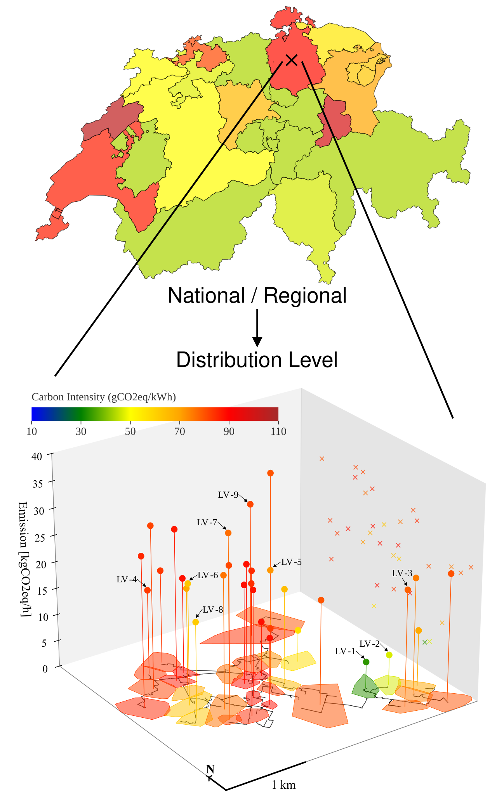
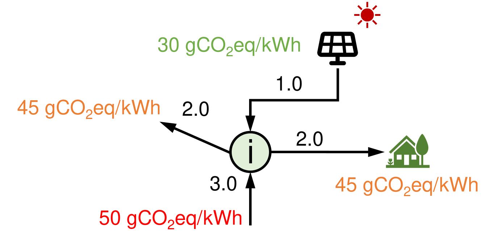
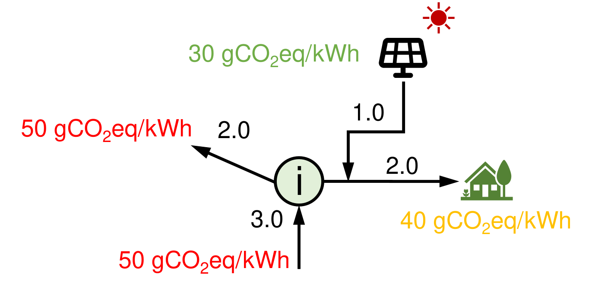
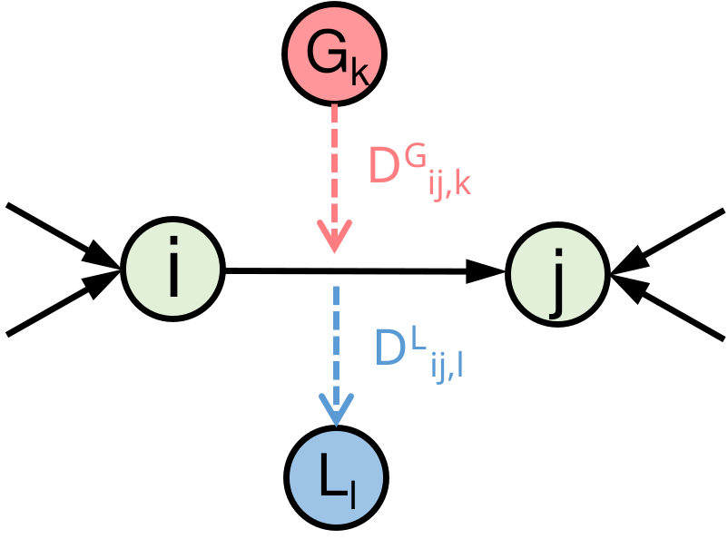
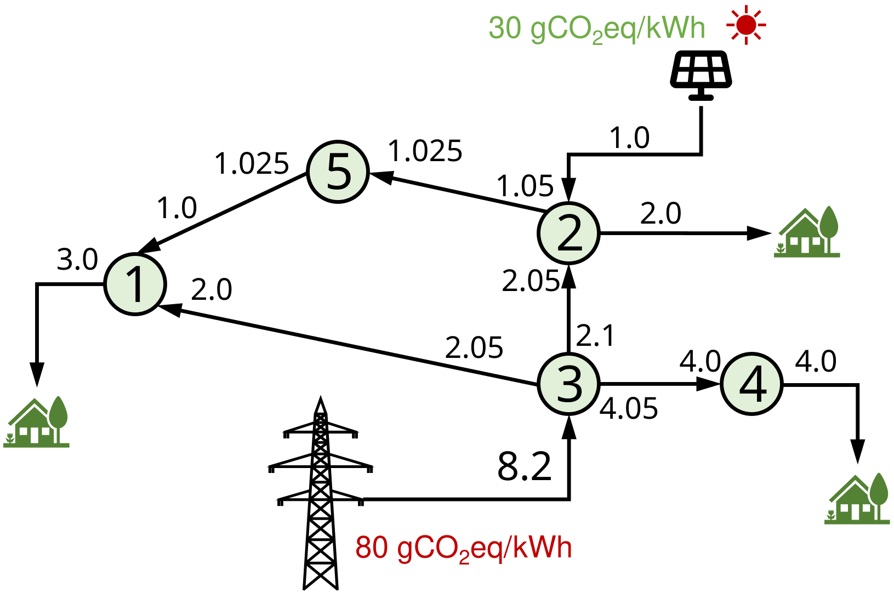
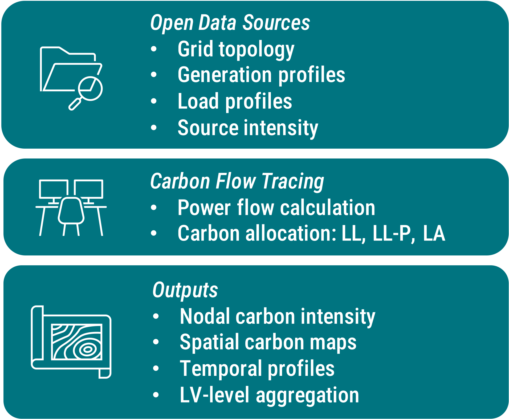

## Background and Motivation


::: {.columns}
::: {.column width = "50%"}


####  Carbon-Aware Energy Transition

Achieving climate targets requires not only reducing emissions, but also understanding where and when emissions occur within increasingly decentralized electricity systems.

<br>

####  Active Distribution Grids

The rapid growth of PV, batteries, EVs, and prosumers introduces bidirectional and highly dynamic power flows, making carbon attribution at the distribution level increasingly important.

<br>

####  Limitations of Existing Carbon Accounting

Most existing approaches rely on regional average emission factors, or transmission-level flow tracing, which cannot capture nodal-level spatial and temporal variations in MV–LV networks.

<br>

####  Need for Practical Distribution-Level Frameworks

A practical framework is needed to integrate open distribution-grid data, allocate carbon responsibility consistently and support carbon-aware analysis for operators, communities and prosumers.


:::
::: {.column width = "10%"}
:::
::: {.column width = "40%"}


{width="70%"}

:::
:::
<!-- end columns -->

## Methodology: Lossless Carbon Allocation without prosumer priority (LL method) {.smaller}


::: {.columns}

::: {.column width = "47%"}


::: {.callout-note}
## Nomenclature

- Inputs
  - node set and branch set: $\mathcal{N}, \mathcal{L}$
  - generation, load, import, and export power at node $i$: $g_i, l_i, m_i, x_i$
  - power inflow to node $j$ from $i$: $F_{i\rightarrow j}^\text{in}$
  - power outflow from node $i$ in direction of $j$: $F_{i\rightarrow j}^\text{out}$
  - injected and imported (from higher-level grids) carbon intensity: ${c_g}_i, {c_m}_i$
- Outputs: nodal carbon intensity: ${c_x}_i$


:::


::: {.callout-caution}
## Core Assumptions

- Perfect mixing at each node
- Carbon follows active power flows, intensity inherited from upstream sources


:::


---

Net power injection and extraction:
$$
\begin{cases}
    p_i^\text{in} &= \max{ \{(g_i - l_i),0 \}} + m_i\\
     p_i^\text{out} &= \max{ \{-(g_i - l_i),0 \}} + x_i
\end{cases}
$$

Nodal power balance [@horschFlowTracingTool2018]:
$$
p_i^\text{in} + \sum_{(i,j)\in\mathcal{L}} F_{j\rightarrow i}^\text{in}  = p_i^\text{out} +  \sum_{(i,j)\in\mathcal{L}} F_{i\rightarrow j}^\text{out}
$$


:::

::: {.column width = "4%"}


:::

::: {.column width = "49%"}


{#fig-LL-example width="60%"}


Nodal carbon balance (average participation assumption):
$$
    g_i {c_g}_i + m_i {c_m}_i + \sum_{j} F_{j\rightarrow i}^\text{in}{c_x}_j = (l_i +x_i){c_x}_i + \sum_{j} F_{i\rightarrow j}^\text{out}{c_x}_i
    \label{eq:nodal-carbon-balance}
$$

The $\bf{c_x}$ values are given the following linear program:
$$
\begin{aligned}
    \min_{\rm{\bf{c_x}}\in\mathbb{R}_+^n}\quad  & \rm{\bf{g}}^\top \rm{\bf{c_g}}+ \rm{\bf{m}}^\top \rm{\bf{c_m}}  -(\rm{\bf{l}}+\rm{\bf{x}})^\top \rm{\bf{c_x}}\\
    \text{s.t.}\quad &\forall\ i\in \mathcal{N}\\
    &0 \leq {c_x}_i\leq\max\{{c_g}_i, {c_m}_i\}\\
    & g_i {c_g}_i + m_i {c_m}_i + \sum_{j} F_{j\rightarrow i}^\text{in}{c_x}_j  \geq (l_i +x_i){c_x}_i + \sum_{j} F_{i\rightarrow j}^\text{out}{c_x}_i
\end{aligned}\label{eq:LP}
$$

The carbon emission responsibility of load at node $i$: ${C\!F_x}_i = l_i{c_x}_i  \label{eq:carbon-emission-LL}$


:::

:::


## Methodology: Lossless Carbon Allocation with prosumer priority (LL-P method) {.smaller}


::: {.columns}

::: {.column width = "47%"}


::: {.callout-note}
## Nomenclature

- Inputs
  - node set and branch set: $\mathcal{N}, \mathcal{L}$
  - generation, load, import, and export power at node $i$: $g_i, l_i, m_i, x_i$
  - power inflow to node $j$ from $i$: $F_{i\rightarrow j}^\text{in}$
  - power outflow from node $i$ in direction of $j$: $F_{i\rightarrow j}^\text{out}$
  - injected and imported (from higher-level grids) carbon intensity: ${c_g}_i, {c_m}_i$
- Outputs: nodal carbon intensity: ${c_x}_i$, [ejected carbon intensity: ${c_o}_i$ (by LL-P)]{style="color: red;"}

:::


::: {.callout-caution}
## Core Assumptions

- Perfect mixing at each node
- Carbon follows active power flows, intensity inherited from upstream sources

:::

---

Net power injection and extraction:
$$
\begin{cases}
    p_i^\text{in} &= \max{ \{(g_i - l_i),0 \}} + m_i\\
     p_i^\text{out} &= \max{ \{-(g_i - l_i),0 \}} + x_i
\end{cases}
$$

Nodal power balance [@horschFlowTracingTool2018]:
$$
p_i^\text{in} + \sum_{(i,j)\in\mathcal{L}} F_{j\rightarrow i}^\text{in}  = p_i^\text{out} +  \sum_{(i,j)\in\mathcal{L}} F_{i\rightarrow j}^\text{out}
$$


:::


::: {.column width = "4%"}
:::

::: {.column width = "49%"}

{#fig-LL-P-example width="60%"}


Introduce ejected carbon intensity ${c_o}_i$ to isolate the responsibility of prosumers:

- Local RES generation is prioritized for local consumption before exports


$$
\begin{aligned}
    \min_{\rm{\bf{c_x,c_o}}\in\mathbb{R}_+^n}\quad  & \rm{\bf{g^\top c_g+ m^\top c_m  -(l+x)^\top c_o}}\\
    \text{s.t.}\quad &\forall\ i\in \mathcal{N}, \quad 0 \leq {c_x}_i\leq\max\{{c_g}_i, {c_m}_i\}\\
    & \begin{cases}
        (l_i+x_i)\cdot {c_o}_i= p_i^\text{out}{c_x}_i + \min\{g_i,l_i \}\cdot {c_g}_i \quad &\text{if}~l_i+x_i>0,\\
        {c_o}_i = {c_x}_i  \quad &\text{else}.
    \end{cases}\\
    &  \max\{{(g_i-l_i),0}\}\cdot{c_g}_i + m_i {c_m}_i  + \sum_{j} F_{j\rightarrow i}^\text{in}{c_x}_j \\
    & \qquad \geq p_i^\text{out}{c_x}_i + \sum_{j} F_{i\rightarrow j}^\text{out}{c_x}_i
\end{aligned}
$$

The carbon flow extracted from the network at node $i$: ${C\!F_x}_i = p_i^\text{out}{c_x}_i$

The carbon emission responsibility of load at node $i$: ${C\!F_o}_i = l_i{c_o}_i$


:::

:::


## Methodology: Carbon Allocation with Losses (LA method) {.smaller}


::: {.columns}

::: {.column width = "49%"}


Key Idea: **Network active power losses also carry carbon responsibility.**

Principle: Branch losses inherit the carbon intensity of transmitted electricity.

<br>


::: {.callout-note}
## Nomenclature

- Additional Inputs
  - topological generation and load distribution factors: $\mathbf{D}^\mathrm{\scriptscriptstyle G}$, $\mathbf{D}^\mathrm{\scriptscriptstyle L}$
  - generalized generation power: $\rm{\bf{P}}^\mathrm{\scriptscriptstyle G} = \max\{(\rm{\bf{g+m - l-x), 0}}\}$ 
  - generalized load power: $\rm{\bf{P}}^\mathrm{\scriptscriptstyle L} = \max\{\rm{\bf{(l+x-g-m), 0}}\}$

:::


::: {.callout-caution}
## Core Assumptions

- Perfect mixing at each node
- Carbon follows active power flows, intensity inherited from upstream sources
- Losses along a branch have the same carbon intensity as the electricity it carries
- Carbon responsibility of losses is allocated to loads based on their contribution to the branch flow


:::


::: {.callout-tip}
## Upstream and Downstream Looking approaches for allocating losses [@bialekTopologicalGenerationLoad1997] 

- $\mathbf{D}^\mathrm{\scriptscriptstyle G}_{ij,k}$: the share of power from generator $k$ to branch flow from node $i$ to node $j$.
- $\mathbf{D}^\mathrm{\scriptscriptstyle L}_{ij,l}$: the share of power from load $l$ to branch flow from node $i$ to node $j$.

Using $\mathbf{D}^\mathrm{\scriptscriptstyle G}$ and $\mathbf{D}^\mathrm{\scriptscriptstyle L}$, we can allocate the emissions associated with network losses to generators and loads, respectively.

:::


:::

::: {.column width = "4%"}


:::

::: {.column width = "47%"}


{#fig-LA-example width="50%"}

<br>

With upstream decomposition, the branch carbon flows:
$$
    C\!F^\text{from}_{ij} = \sum_{k\in\mathcal{N}_\mathrm{\scriptscriptstyle G}} D^\mathrm{\scriptscriptstyle G}_{ij,k}\cdot{P_k^\mathrm{\scriptscriptstyle G}}\cdot C\!I^\mathrm{\scriptscriptstyle G}_k \label{eq:branch-carbon-flow-generation}
$$

The branch carbon intensity:
$$
C\!I_{ij} = \frac{C\!F^\text{from}_{ij}}{F_{ij}} \label{eq:branch-carbon-intensity} 
$$


:::

:::


## Methodology: Carbon Allocation with Losses (LA method, Cont'd) {.smaller}


::: {.columns}

::: {.column width = "49%"}


Key Idea: **Network active power losses also carry carbon responsibility.**

Principle: Branch losses inherit the carbon intensity of transmitted electricity.

<br>

::: {.callout-note}
## Nomenclature

- Additional Inputs
  - topological generation and load distribution factors: $\mathbf{D}^\mathrm{\scriptscriptstyle G}$, $\mathbf{D}^\mathrm{\scriptscriptstyle L}$
  - generalized generation power: $\rm{\bf{P}}^\mathrm{\scriptscriptstyle G} = \max\{(\rm{\bf{g+m - l-x), 0}}\}$ 
  - generalized load power: $\rm{\bf{P}}^\mathrm{\scriptscriptstyle L} = \max\{\rm{\bf{(l+x-g-m), 0}}\}$

:::


::: {.callout-caution}
## Core Assumptions

- Perfect mixing at each node
- Carbon follows active power flows, intensity inherited from upstream sources
- Losses along a branch have the same carbon intensity as the electricity it carries
- Carbon responsibility of losses is allocated to loads based on their contribution to the branch flow


:::


::: {.callout-tip}
## Upstream and Downstream Looking approaches for allocating losses [@bialekTopologicalGenerationLoad1997] 

- $\mathbf{D}^\mathrm{\scriptscriptstyle G}_{ij,k}$: the share of power from generator $k$ to branch flow from node $i$ to node $j$.
- $\mathbf{D}^\mathrm{\scriptscriptstyle L}_{ij,l}$: the share of power from load $l$ to branch flow from node $i$ to node $j$.

Using $\mathbf{D}^\mathrm{\scriptscriptstyle G}$ and $\mathbf{D}^\mathrm{\scriptscriptstyle L}$, we can allocate the emissions associated with network losses to generators and loads, respectively.

:::

:::

::: {.column width = "4%"}


:::

::: {.column width = "47%"}


Downstream-looking gives the contribution of the load in node $k$ to the losses occurring in the branch going from node $i$ to $j$:
$$
Contri_{ij,k} = \frac{D^\mathrm{\scriptscriptstyle L}_{ij,k}\cdot{P^\mathrm{\scriptscriptstyle L}_{k}}}{F_{ij}} \label{eq:load-contribution-to-losses}
$$

Allocated carbon from losses to node $k$:
$$
Surcharge_k = \sum_i\sum_j Contri_{ij,k} \cdot Losses_{ij}\cdot C\!I_{ij}
$$
$$
Losses_{ij} = F_{ij}+F_{ji}
$$

The carbon flow injected to the network at node $i$ without considering losses:
$$
{\hat{C\!F_x}}_i = \sum_j F_{ij}\cdot C\!I_{ij}
$$
Add surcharges:
$$
{C\!F_x}_i = \begin{cases}
    {\hat{C\!F_x}}_i + Surcharge_i\quad &\text{for}\quad i\in\mathcal{N}_\mathrm{\scriptscriptstyle L}\\
    {\hat{C\!F_x}}_i &\text{for}\quad i\in\mathcal{N}_\mathrm{\scriptscriptstyle G}
\end{cases}
$$

The intensity is given by

$$
{C\!F_x}_i = (P^\mathrm{\scriptscriptstyle G}_i - P^\mathrm{\scriptscriptstyle L}_i){c_x}_i
$$


:::

:::


## Case Study: 5-node Network


<br>

::: {.columns}

::: {.column width="50%"}

- Node 1 and 4: consumers with associated loads.
- Node 2: a prosumer with PV installation.
- Node 3: imports electricity from higher-level grids.
- Node 5: an interconnected transfer node.

<br>
<br>

{#tbl-5node width="100%"}


:::

::: {.column width="6%"}


:::

::: {.column  width="44%"}

<br>

{#fig-5node width="80%"}


:::

:::


## Case Study: Synthetic Swiss Distribution Grid - Topology


::: {#fig-swiss-pdgs}
```{=html}
<div style="width: 1400px; height: 850px;  margin: auto;">
  <iframe src="./swiss-pdgs-vis/show.html" style="border: none; width: 100%; height: 100%;"></iframe>
</div>
```

Synthetic Swiss MV–LV distribution grid inferred from open geospatial and infrastructure datasets from [@guptaCountrywidePVHosting2021;@onetoLargescaleGenerationGeoreferenced2025], with generation plant data from [@ElectricityProductionPlants]. 
:::


## Case Study: Synthetic Swiss Distribution Grid - Generation and Load Profiles {.smaller}


::: {.columns}

::: {.column width="51%"}
### Generation Profiles


##### PV Generation Model: Weather Data + Roof Info

- A high fidelity PV generation model that accounts for the inclination and orientation of the PV panels [@jensenPvlibIotoolsOpen2023]
- Irradiance data from [@zippenfenigOpenMeteocomWeatherAPI2024]


$$
P_\text{dc} = \frac{I_\text{tilt}}{1000} P_\text{rated} ( 1 + \gamma_\text{pdc} (T_\text{cell} - T_\text{ref}))
$$


$$
I_\text{tilt} = \mathrm{DNI} \cdot \cos\theta + \mathrm{DHI} \cdot \left(\frac{1 + \cos\beta}{2}\right) + \mathrm{GHI} \cdot \rho \cdot \left(\frac{1 - \cos\beta}{2}\right) \label{eq:tilt-irradiance}
$$

##### Other Generation Models

A simple flat generation profile for other types of generators due to the limited connection in the Swiss distribution grid


::: {#fig-sgen-line}

```{=html}
<div style="display: flex; justify-content: center; gap: 50px; text-align: center;">
    <div id="sgen-line" style="display: flex; justify-content: center; gap: 0px; "></div>
</div>

<script>
renderPlotly("sgen-line", "./files/sgen_line.json");
</script>
```

Output power of 9 selected PV plants over 4 days within the selected distribution network.
:::

:::

::: {.column width="5%"}


:::

::: {.column width="44%"}

### Load Profiles

<br>

BDEW electricity demand profiles [@amedeoOemofDemandlibOemofdemandlib2017] + land use data [@SwissLandUse]

Match the load profiles to the load nodes based on the land use type of the node's location

<br>

Examples:

- *Residential areas (1 or 2-family houses)*: BDEW type H0 (Households)
- *Agricultural buildings and surroundings*: BDEW type L0 (General farms)
- *Public buildings and surroundings*: BDEW type G1 (Business on weekdays 8am - 6pm)

<br>
<br>

::: {#fig-load-line}
```{=html}
<div style="display: flex; justify-content: center; gap: 50px; text-align: center;">
    <div id="load-line" style="display: flex; justify-content: center; gap: 0px; "></div>
</div>

<script>
renderPlotly("load-line", "./files/load_line.json");
</script>
```

Normalized load factor generated for Dietlikon over a week.
:::

:::

:::


## Case Study: Synthetic Swiss Distribution Grid - Source Intensity


<br>

::: {.columns}

::: {.column width="51%"}

#### Generation Plants


<br>


| Category | Number | Total capacity [MW] | Carbon intensity [gCO<sub>2</sub>eq/kWh] |
|:------:|:---:|:-------:|:---------:|
| Photovoltaic | 226268 | 5391.0 | 30 |
| Hydroelectric | 990 | 13979.1 | 24 |
| Biomass | 327 | 151.1 | 230 |
| Natural gas | 117 | 266.3 | 528 |
| Wind | 43 | 77.47 | 11 |
| Waste | 18 | 220.8 | 580 |
| Nuclear | 4 | 3014.6 | 12 |
| Crude oil | 1 | 0.0053 | 650 |
| | | | |


: The statistics of Swiss generation types [@ElectricityProductionPlants] and carbon intensities [@mapsSwitzerland2024Carbon2024] in 2023. {#tbl-gen-stats}

:::

::: {.column width="5%"}


:::

::: {.column width="44%"}

#### Transmission-Level Carbon Signals

<br>

[Emissium](https://emissium.io/) provides the dynamic carbon intensity at the transmission level in Switzerland:

- Cantonal-level geographical granularity
- Hourly temporal resolution


<br>

::: {#fig-canton-ci}
```{=html}
<div style="display: flex; justify-content: center; gap: 50px; text-align: center;">
    <div id="canton-ci" style="display: flex; justify-content: center; gap: 0px; "></div>
</div>

<script>
renderPlotly("canton-ci", "./files/canton_ci.json");
</script>
```

Carbon intensity of the higher-level grid for the canton of Zurich, Vaud and Ticino over three days.
:::


:::

:::


## Case Study: Synthetic Swiss Distribution Grid - Carbon Flow Tracing Results 


::: {#fig-swiss-pdgs}
```{=html}
<div style="width: 1600px; height: 900px;  margin: auto;">
  <iframe src="./files/res-json/vis-json.html" style="border: none; width: 100%; height: 100%;"></iframe>
</div>
```

Visualization of the carbon tracing results (LL-P method) of a synthetic Swiss distribution network over two days with hourly resolution. The network comprises 122 MV nodes, 2986 LV nodes,
33 transformers, and 131 distributed generators. Local PV penetration creates spatial and temporal heterogeneity in carbon intensity across LV networks.
:::

## Case Study: Synthetic Swiss Distribution Grid - Carbon Flow Tracing Results (Cont'd)


::: {.columns}

::: {.column width="48%"}


#### Temporal Variability

<br>  

::: {#fig-line}

```{=html}
<div style="display: flex; justify-content: center; gap: 50px; text-align: center;">
    <div id="line" style="display: flex; justify-content: center; gap: 0px; "></div>
</div>

<script>
renderPlotly("line", "./files/line.json");
</script>
```

Hourly carbon intensities at the HV level (black) and LV-level aggregates (colored) over four winter days.
:::


<br>
<br>


#### Computational Performance

<br>

| Metric | LL | LL-P | LA | LA (Numba) |
|:----------------:|:------:|:------:|:------:|:---------:|
| Runtime [s]    | 1.0    | 1.0    | 198    | 9.9    |
| Peak memory [MB]    | 310   | 310    | 1162    | 715    |


: Benchmark of the three allocation methods for a single snapshot of the selected network. {#tbl-benchmark} 


:::

::: {.column width="5%"}


:::

::: {.column width="47%"}


#### Seasonal Variability

::: {#fig-violin}

```{=html}
<div style="display: flex; justify-content: center; gap: 50px; text-align: center;">
    <div id="violin" style="display: flex; justify-content: center; gap: 0px; "></div>
</div>

<script>
renderPlotly("violin", "./files/violin.json");
</script>
```

Distribution of carbon intensities of the LV networks.
:::

::: {#fig-pie}

```{=html}
<div style="display: flex; justify-content: center; gap: 50px; text-align: center;">
    <div id="pie" style="display: flex; justify-content: center; gap: 0px; "></div>
</div>

<script>
renderPlotly("pie", "./files/pie.json");
</script>
```

Electricity and CO2 source mix of a representative LV network.
:::


:::

:::


## Open Source Package: `cflowdist`


::: {.columns}

::: {.column width="50%"}

The proposed framework is being released as the open-source  Python package `cflowdist` for synthetic MV–LV distribution grids in Switzerland:

- open geospatial, infrastructure and meteorological data integration,
- power flow calculation (empowered by   ), 
- time-series computation,
- multiple carbon allocation schemes (LL, LL-P, LA),
- and built-in visualization tools.


```{.python code-line-numbers="1-3|4-7|8-9|10-14|15-16"}
# Import and initialize the tracer
import cflowdist as cfd
tracer = cfd.CarbonTracer(address = '8305 Dietlikon')
# Set snapshots
t_start = '2023-06-01 00:00:00'
t_end = '2023-06-30 23:00:00'
snapshots = tracer.set_snapshots(t_start=t_start, t_end=t_end)
# Run power flow
tracer.power_flow()
# Run carbon allocation (LL-P method)
ci = tracer.allocate_carbon(
    loss_allocation=False,
    self_consumption=True
)
# Visualization
tracer.network_carbon_plot(snapshot = snapshots[12])
```


:::

::: {.column width="6%"}


:::

::: {.column width="40%"}

{#fig-flow width="70%"}

::: {#qr-code align-items="center"}
```{=html}


<div class="svg-container" style="display: flex; justify-content: center; gap: 80px; margin-top: 10px;">
  <div class="svg-viewbox" id="svg-viewbox-cflowdist-docs" style="width: 310px;">
    <div class="qrcode" id="qrcode-cflowdist-docs"></div>
    <div class="qrcode-caption">
      <i class="bi bi-file-earmark-richtext"></i> Documentation
    </div>
  </div>
  <div class="svg-viewbox" id="svg-viewbox-cflowdist-repo" style="width: 310px;">
    <div class="qrcode" id="qrcode-cflowdist-repo"></div>
    <div class="qrcode-caption">
      <i class="bi bi-github"></i> Repository
    </div>
  </div>
</div>

<script>
var qrcode_cflowdist_docs = new QRCode({
  content: "https://desl-epfl.github.io/cflowdist/",
  container: "svg-viewbox", //Responsive use
  join: true //Crisp rendering and 4-5x reduced file size
});
var svg_qrcode_cflowdist_docs = qrcode_cflowdist_docs.svg();
document.getElementById("qrcode-cflowdist-docs").innerHTML = svg_qrcode_cflowdist_docs;
</script>


<script>
var qrcode_cflowdist_repo = new QRCode({
  content: "https://github.com/desl-epfl/cflowdist",
  container: "svg-viewbox", //Responsive use
  join: true //Crisp rendering and 4-5x reduced file size
});
var svg_qrcode_cflowdist_repo = qrcode_cflowdist_repo.svg();
document.getElementById("qrcode-cflowdist-repo").innerHTML = svg_qrcode_cflowdist_repo;
</script>
```
:::


:::

:::


## Conclusion and Future Work

<br>

::: {.columns}
::: {.column width="46%"}

### Key Takeaways

- Developed a unified framework for carbon flow tracing in MV–LV distribution grids, including:
  - lossless allocation (LL),
  - lossless prosumer-priority allocation (LL-P),
  - and losses-inclusive allocation (LA).

<br>


- Applied the framework to a synthetic Swiss distribution grid, revealing significant spatial and temporal variations in carbon intensity at the LV level that cannot be captured using conventional regional-average approaches.

<br>

- Released the framework as the open-source Python package `cflowdist`, supporting reproducible research and practical applications in distribution-level carbon accounting.


:::

::: {.column width="8%"}
:::

::: {.column width="46%"}


### Future Directions

- Incorporate:
  - battery energy storage systems (ongoing work)

<br>

- Extend the framework to:
  - losses due to reactive power flows
  - near real-time carbon signals

<br>

- Explore applications in:
  - carbon-aware energy management
  - local energy community operations
  - distribution-system planning

:::
:::


## References

::: {#refs}
:::


## {.unnumbered background-image="./files/thanks.jpg" background-size="cover" background-position="center" id="thanks-slide"}


```{=html}
<div class="epfl-title-container">
        
    <div class="title-group" style="position: absolute; top: 40%; transform: translateY(-50%) translateX(0%);">
        <div class="event-name" style="color: #FFF; font-size: 1.2rem; letter-spacing: 1px; text-transform: uppercase; margin-bottom: 15px;"> </div>
        <h1 class="presentation-title" style="font-size: 6.2rem; color: #FFF; font-weight: 800; margin: 0; line-height: 1.1;">
          Thank you for your attention !
        </h1>
    </div>

    <div class="epfl-block-svg">
        
    </div>

    <div class="info-boxes">
        <div class="info-box-right red-box">
            <div class="info-value" style="font-size: 1.6rem; line-height: 1.5; opacity: 0.9;">Presented by</div>
            <div class="info-value" style="font-size: 1.8rem; font-weight: 700; text-align: center;">Wenyu Liu</div>
        </div>
    </div>

</div>
```
